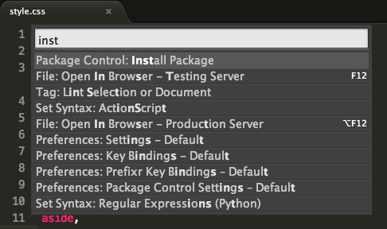

# sublime text

웹언어를 사용하기 위해서는 에디트 또는 IDE를 사용하는것이 보다 빠르고 쉽습니다.
에디트와 IDE의 차이는 무엇이 있을까요?
간단하게 설명하자면 
에디트는 가볍고 간단한 기능을 만들어놓은 툴이며 필요기능을 직접 하나하나 설치해야하는 불편함이 있습니다,
IDE는 무겁지만 많은 기능을 담아놓은 툴이며, 대부분의 기능이 설치되어 있습니다.(물론 필요시 추가기능을 설치할 수 있습니다.)

사실상 크게 구분하지 않아도 되는 부분입니다. 
서브라임텍스트의 경우는 가볍고 빠르게 개발할 수 잇는 에디트입니다.
하지만 위에서 간단하게 언급했지만 별다른 기능이 없기 때문에 몇가지 추가 기능을 설치해야 하는 불편함이 있습니다.
여기서 빠르게 설치하고 사용하도록 하겠습니다.

---

## setting

서브라임텍스트를 설치해 보겠습니다.
<https://www.sublimetext.com/3>

위 링크로 이동하면 에디트를 설치 할 수 있습니다.
해당 OS를 확인하시고 다운받아 설치하세요.

서브라임텍스트는 유료입니다.
그렇기 때문에 일정 횟수만큼 작업 및 저장하면 제품결제하라는 메시지가 나옵니다.
하지만 취소 버튼을 누르면 특별하게 결제를 물어보지 않습니다.(일정한 주기로 메시지가 나옵니다)

사실상 유료제품이지만 무료로 사용이 가능하다는 결론입니다.

---

### package

서브라임텍스트를 최초의 상태로 작업하기에는 다소 불편한 부분들이 많습니다.
그렇기 때문에 몇가지를 미리 설치하고 사용하는 것을 권합니다.
이러한 추가 설치하는 기능을 팩키지 라고 합니다.

<https://packagecontrol.io/>

위 링크페이지로 이동하면 서브라임텍스트의 다양한 팩키지(플러그인)을 검색해 볼 수 있습니다.

먼저 팩키지를 설치할 수 있도록 기본 팩키지를 설치해 보도록 하겠습니다.
여기서 말하는 팩키지는 위 페이지에 있는 팩키지를 실행하려면 기본 팩키지가 하나 설치된 후 이를 통해 사용할 팩키지를 설치해야합니다. 

쉽게 설명하자면, 안드로이드 의 다양한 앱을 사용하려면 안드로이드 앱스토어가 설치되어 있어야하는데
이런 기본 앱스토어가 설치되지 않았기 때문에 앱스토어를 설치한다는 의미와 동일합니다. 

설치는 아주 간단합니다.
**메뉴> Tools>  Command palette**를 클릭하면 별도의 화면이 나타납니다.
이곳에 **package**를 검색하면 package를 설치할 수 있도록 나타납니다 우선 해당하는 것을 선택하여 설치해야 합니다. 

왼쪽하단을 보면 " **=** " 모양이 계속 움직이는 것을 알 수 있습니다. 팩키지가 설치되고 있다는 의미입니다.

설치된이후 다시 **메뉴> Tools>  Command palette**를 선택한 후

**install package**를 입력하면 (간단하게 ip라고 입력하여도 됩니다.) 여러 목록 중 설치하려는 항목이 나타납니다.
이를 선택하면 추가로 검색하는 창이 나오는데 이곳에 설치하려고 하는 다양한 팩키지를 입력하여 설치하면 됩니다.

 

팩키지는 **한번에 하나씩 설치가 가능**하므로 위의 내용의 순서로 
**메뉴> Tools>  Command palette**를 통해 팩키지 접속 후 **install package**를 입력하여 추가 설치할 수 있도록 합니다.

---

### 추천 팩키지

1. emmet	: html/css단축 용어( <https://docs.emmet.io/cheat-sheet/>)
2. IME support : 한글입력이 늘지는 현상을 줄이기 위한 플러그인(맥의 경우는 설치할 필요 없음)
3. open in browser : 크롬/사파리/파이어폭스/익스프로러 등 다양한 브라우저를 바로 확인할때 사용
4. view in browser : 위와 동일한 기능(맥의 경우는 기본브라우저로 설정된 브라우저로 실행)
5. terminal : 터미널을 바로 실행하도록 처리
6. sidebar: 사이드바의 기능을 강화하도록 처리
7. file navigation: 현재폴더의 위치를 파악하여 연결된 파일경로를 자동으로 찾아주는 기능
8. autoFileName: file navigation기능과 유사한기능 좀더 편한 기능으로 설치권장
9. theme senti_UI: 테마 에디트의 모양이 좀더 깔끔하게 정리(설치하지 않아도 무관)
10. alignment: 작업의 라인정리를 좀더 깔끔하게 처리할 수 있는 기능
11. Increment selection: 여러줄 자동으로 순서에 맞게 숫자입력되게 처리
12. markdown preview: md파일 미리보기기능
13. rem px: px단위와 rem단위를 쉽게 변환처리
14. scss: scss언어를 사용할 수 있도록 처리

---

###  단축키 사용법

서브라임텍스트 에디트는 다양한 단축키를 통한 여러 기능을 사용할 수 있습니다.
내용이 많고 os에 따라 조금씩 다르므로 아래 링크를 통해 별도로 확인하시기 바랍니다. 

[단축키 설명 영상](https://www.youtube.com/watch?v=utLIfDpGKsY)

- [mac용 단축키 바로가기](./sublimetext_shotcut_osX.md)
- [windows용 단축키 바로가기](./sublimetext_shotcut_win.md)

---

###  cli에서 sublimetext  명령어로 실행 설정하기 

osX는 **terminal**이나, **iTerm**을 통해서, windows는 **git-bash**를 통해 sublimetext를 보다 빠르게 실행할 수 있습니다. 
아래를 통해 설정하여 사용하시길 권해드립니다. 

처음에는 단순하게 프로그램 실행하여 사용할 수 있지만, 잡은 폴더 이동과 다양한 작업으 통하다보면 **CLI**프로그램을 통하는 것이 좀더 빠르고 정확하게 사용할 수 있습니다.

[mac설정 유투브 확인하기](https://www.youtube.com/watch?v=P6IlgugDoGw)

[window설정 유투브 확인하기](https://www.youtube.com/watch?v=vERWpzH7PBM)